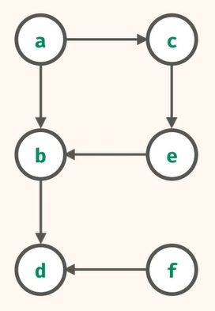

# Types of Graphs
There are 2 types of graphs
1. Directed graph
2. Undirected graph

# Types of algorithms to traverse the Graph
1. dfs
2. bfs

# programmatic representation of Graph
- Graph is represented by dictionary when it comes to python language
- Let's represent below graph with the help of dictionary.
   
    
  </img> 
Here, keys are nodes & corresponding values are it's neighbours.
{
    a: [b, c],
    b: [d],
    c: [e],
    d: [],
    e: [b],
    f: [d]
}
